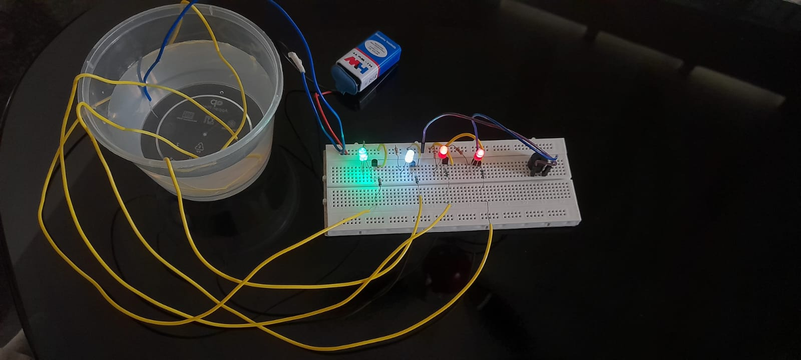
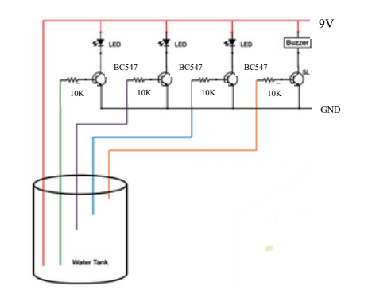
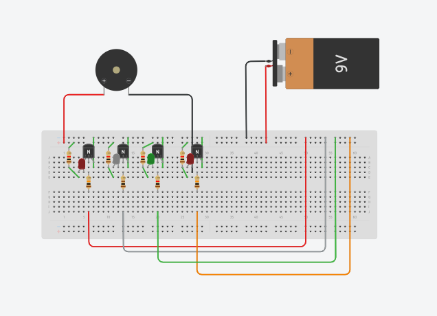

# Water Level Indicator Using BC547 Transistor

A low-cost, transistor-based water level indicator that monitors four distinct water levels using NPN transistors and LEDs, featuring an audible buzzer alert for tank overflow prevention.

---

## 📷 Hardware Setup & Overview

---

## ⚡ Circuit Diagram & Schematic

### Schematic Diagram

### Tinkercad Simulation View

> 🔗 **Interactive Simulation:** [View and simulate this circuit on Tinkercad](https://www.tinkercad.com/things/7YOiGNxNkxB-water-level-indicator?sharecode=mQjLodyY3vDiRX1qlZtljvBxX3bGb25HVmguMjSJVCY)

---

## 🛠️ Components Required

| Quantity | Component | Description / Value |
| :---: | :--- | :--- |
| **4×** | BC547 NPN Transistors | Used as switches |
| **4×** | LEDs | Level indicators |
| **4×** | Resistors | 10kΩ (Base current limiting) |
| **4×** | Resistors | 1kΩ (LED current limiting) |
| **1×** | Buzzer | 9V alert buzzer |
| **1×** | Power Source | 9V Battery |
| **Misc** | Breadboard & Wires | Circuit assembly & level probes |

---

## 💡 How It Works

1. **Empty Tank:** All transistors remain in cutoff mode (OFF); LEDs and buzzer stay OFF.
2. **Levels 1–3:** Water contacts successive level probes, sending a small base current to turn ON each corresponding BC547 transistor and light its LED.
3. **Level 4 (Max Level):** The final probe triggers the fourth transistor, turning ON the LED and activating the buzzer to signal full capacity.

---

## 📄 Documentation

* Read the full project documentation in [docs/MICROPROJECT_REPORT.pdf](docs/MICROPROJECT_REPORT.pdf).

---
